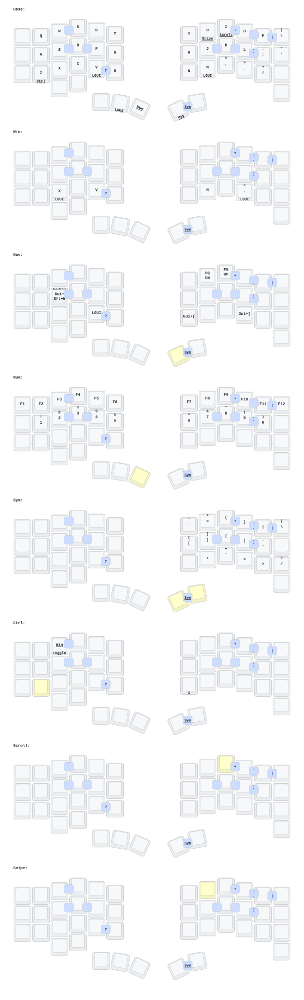

This keeb created by a group of people who loves keyball.

Special Thanks to:  
PCB: *[yangxing844](https://github.com/yangxing844)*  
Case: *[delock](https://github.com/delock)*  
Firmware: *[Amos698](https://github.com/Amos698)*  

---

## Dongle setup (3 pieces)

This config builds a **keyless nice!nano dongle as the BLE central**, with both
halves as peripherals. `build.yaml` produces four `.uf2`s:

| Artifact | Role |
| --- | --- |
| `keyball44_dongle-nice_nano_v2` | central: keymap, ZMK Studio, USB/BLE to the host |
| `keyball44_left-nice_nano_v2` | peripheral: left matrix + nice!view |
| `keyball44_right-nice_nano_v2` | peripheral: right matrix + nice!view + trackball |
| `settings_reset-nice_nano_v2` | wipes BLE bonds; flash to any board |

### Why a dongle

The host only ever talks to the dongle, so BLE profile switching, USB, and
Studio all live on a device that never moves and never sleeps; the halves only
maintain one short link each.

### Where things live

- **Keymap** (`config/keyball44.keymap`) is compiled into all three builds but
  only *acts* on the central. ZMK resolves the shield name `keyball44_dongle`
  down to the candidate `keyball44`, which is how the shared keymap and
  `config/keyball44.conf` reach the dongle build.
- **Trackball** is physically on the right half. It is forwarded over BLE with
  `zmk,input-split` (`keyball44_trackball_split.dtsi`) and turned into pointer
  HID by the listener that only the dongle enables.
- **Scroll / snipe** used to be driver features on the right half. Those read
  the active layer, which exists only on the central, so they are now
  layer-gated `input-processors` on the dongle (`keyball44_dongle.overlay`).
  The two scaler values there are the tuning knobs.
- **PMW3610 driver** is central-only upstream: it reads the active layer (and
  the behaviour queue) unconditionally, and ZMK compiles neither into a
  peripheral. `src/pmw3610_peripheral_stubs.c` supplies weak stubs so the right
  half links; they are never semantically live, because the layer lists on the
  sensor node are empty.
- **Displays**: content is chosen by split *role*, geometry by *side*
  (`src/kb_display.c`). Both halves are peripherals now, so both show
  battery + split link + Orbit, each in its own case-window box. Nothing
  displays the BT profile any more — the central has no screen.

### Flashing and pairing

Order matters: bonds are stored per device, and a half that still remembers the
old right-half central will not find the dongle.

1. Flash `settings_reset` to **all three** boards first, one at a time.
2. Flash `keyball44_dongle` to the dongle, then `keyball44_left` and
   `keyball44_right` to the halves.
3. Power all three. The halves auto-pair to the dongle; each nice!view shows
   `LINKED` (`LINK` on the narrower right screen) once it finds it.
4. Pair the **dongle** to the host over BLE, or just leave it on USB.

Bootloader on a nice!nano: double-tap reset. On these boards that means
double-shorting `RST` to `GND`.

### If something is wrong

- **A half never links**: it kept a stale bond. `settings_reset` that half (and
  the dongle if it was re-flashed), then repeat from step 1.
- **Cursor keeps gliding after the ball stops**: the forwarding hop adds a BLE
  link. Lower the polling rate or raise `CONFIG_PMW3610_MOVEMENT_THRESHOLD` in
  `keyball44_right.conf` — the reasoning is written out there.
- **Only 5 BT profiles**: that is the cap. `ZMK_BLE_PROFILE_COUNT` is
  `BT_MAX_PAIRED - peripherals`, i.e. `7 - 2`, set in `keyball44_dongle.conf`.
